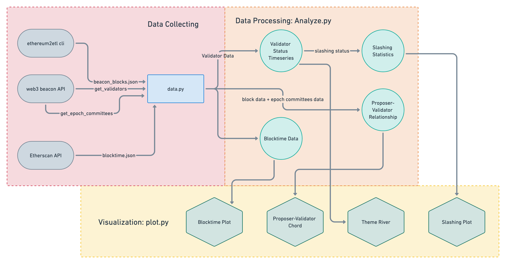

# The Beacon Chain Dynamics at Merge: Evaluating Consensus Decentralization and Security Via Validator Life Cyle Visualzations


Figure 1 demostrates how our code collect and visualize data.


Figure 1 the Data Science Pipeline

## How to run code?

The code is written in Python 3.9.12. We use pipenv to manage the environment.

First, set up the environment by 

```shell
pipenv install
```

Then, activate the environment by

```shell
pipenv shell
```

## Data Descriptor

The data is stored in the [`data`](https://github.com/sunshineluyao/merge-data-challenge-update/tree/master/data) folder. The explaination of data files can be found at [data/Readme.md](data/Readme.md).


